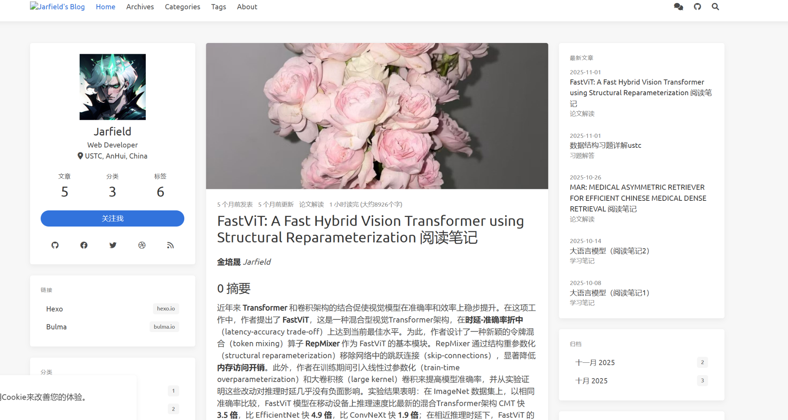

# Embedding Research Hub 网站需求说明

## 1. 项目目标

构建一个可直接使用、后续易扩展的 Embedding 研究型网站。  
它不是普通个人博客，而是一个以“知识组织”为核心的在线仓库，服务于以下目标：

1. 系统解释 Embedding 的整体目的、发展脉络与研究问题。
2. 按专题整理 Embedding 各子方向的研究进展。
3. 收录综述、经典论文、最新论文、大牛/大厂 blog。
4. 支持我持续输出自己的阅读笔记、阶段性总结和方法论理解。
5. 网站必须适合长期维护，新增内容时尽量只需要新增一篇文档，而不是改很多页面。

---

## 2. 整体原则

### 2.1 内容优先
页面重点是“信息结构清楚”，不是炫技式设计。  
视觉上可以简洁，但必须便于浏览、检索、归档和持续更新。

### 2.2 先做可用版本
第一版不追求复杂交互，优先做到：
- 能看
- 能分类
- 能按主题汇总
- 能持续加内容
- 能明显区别“综述 / 论文 / blog / 笔记 / 专题页”

### 2.3 适合 GitHub 托管
网站应天然适合放在 GitHub 上维护，最好是静态站点思路。  
要求内容组织清晰，后续可以只通过增删 Markdown 或文章文件完成更新。

### 2.4 以“研究仓库”而不是“流水博客”为中心
不能只是按时间倒序发文章。  
必须让用户能按“主题”“问题”“资源类型”“时间阶段”理解内容。

---

## 3. 建议的网站定位

网站名称可以理解为：  
**Embedding Research Hub / Embedding Notes / Embedding Atlas**

网站定位为三层结构：

1. **认知层**：Embedding 是什么，解决什么问题，经历了怎样的发展。
2. **资源层**：综述、经典论文、最新论文、博客、观点文章。
3. **输出层**：我自己的笔记、专题总结、路线图、理解框架。

---

## 4. 首页与整体布局

## 4.1 首页目标
首页不是简单文章列表，而是整个网站的入口页。  
用户进入首页后，应该立刻知道三件事：

1. 这个网站是做什么的。
2. 这里有哪些内容板块。
3. 从哪里开始看最合适。

## 4.2 首页应包含的区域

### A. 顶部导航栏
导航栏建议包含：
- Home
- Overview
- Topics
- Resources
- Notes
- Trends
- About

如果想更精简，也可以是：
- 首页
- 总览
- 专题
- 资料库
- 笔记
- 关于

### B. 网站简介区域
首页上方需要有一段非常短的说明，明确：
- 网站聚焦 Embedding 研究
- 内容包括综述、论文、blog、笔记和专题整理
- 强调“长期更新的研究型知识仓库”

### C. 快速入口区域
用 4 到 6 个模块卡片作为首页主入口，建议是：
- Embedding 总览
- 研究专题
- 综述与经典
- 最新进展
- 我的笔记
- 值得读的 Blog

### D. 最近更新区域
展示最近更新的内容，数量控制在 5 到 8 条。  
这里可以显示：
- 标题
- 类型（综述 / 论文 / 笔记 / blog）
- 日期
- 所属专题

### E. 入门路线区域
单独放一个“从哪里开始”的入口，适合新读者：
- 先看 Embedding 总览
- 再看两三篇综述
- 再进入具体专题
- 再看近期热点和个人笔记

这个区域很重要，因为你的目标用户中会有初学者。

---

## 5. 核心模块设计

建议第一版只做 **6 个核心模块**，避免一开始拆得过细。

---

## 5.1 模块一：Overview（Embedding 总览）

### 模块定位
这是全站最重要的“总入口页面”，不是普通文章，而是一篇长期维护的总纲页面。

### 这个模块要回答的问题
1. Embedding 的总体目的是什么？
2. 它为什么重要？
3. 它经历了哪些关键阶段的发展？
4. 最近几年真正重要的新问题是什么？
5. 目前主流范式是什么？
6. 未来热点在解决什么问题？

### 页面内容结构建议
建议这页包含以下固定部分：

#### 1. Embedding 的定义与目标
不是只讲“把东西映射到向量空间”，而是讲清楚：
- 表征
- 相似性
- 检索
- 泛化
- 下游任务对接

#### 2. 发展脉络
建议按阶段写，而不是堆方法名：
- 早期分布式表征
- 预训练模型时代的表征
- Sentence Embedding / Dense Retrieval 阶段
- Instruction / Task-aware Embedding 阶段
- Efficiency / Multilingual / Long Context / Domain-specific 阶段

#### 3. 核心研究问题
例如：
- 如何提升检索效果
- 如何提升泛化能力
- 如何对齐不同任务
- 如何降低推理和存储成本
- 如何适应长文本、多语言、领域数据
- 如何兼顾训练目标与部署约束

#### 4. 当前主流范式
这一部分不追求面面俱到，但要组织清楚：
- 对比学习
- 双塔 / bi-encoder
- 指令式 embedding
- hard negative
- late interaction / contextual embedding
- MRL / quantization / efficiency-oriented design
- MoE / sparse representation 等新趋势

#### 5. 热门方向与未来问题
这里只讲“在解决什么问题”，而不是只列热点名词。

### 页面作用
这页相当于整个网站的“总目录 + 总叙事”。

---

## 5.2 模块二：Topics（研究专题）

### 模块定位
把 Embedding 拆成若干可长期维护的专题页。  
每个专题页不是单篇文章，而是一个“专题入口”。

### 建议第一版的专题划分
不宜过多，建议先做 6 到 8 个：

1. Text Embedding
2. Dense Retrieval
3. Multilingual Embedding
4. Long-context / Contextual Embedding
5. Efficient Embedding
6. Domain-specific Embedding
7. Training Paradigms
8. Evaluation & Benchmarks

如果想更贴近你的兴趣，可以进一步突出：
- Efficient Embedding for RAG
- Sparse / MoE Embedding
- Compression / Quantization / MRL
- Retrieval-oriented Embedding

### 每个专题页应包含的固定结构

#### 1. 专题简介
这个方向在研究什么，为什么重要。

#### 2. 关键问题
这一专题下真正的核心矛盾是什么。

#### 3. 发展脉络
按时间或阶段梳理，不要只是罗列论文。

#### 4. 代表性方法
列出关键方法流派即可。

#### 5. 推荐资源
分成：
- 综述
- 经典论文
- 最新论文
- 高质量 blog
- 相关笔记

#### 6. 我的理解 / 我的关注点
这一块是你的网站差异化来源，不要缺失。

### 页面作用
专题页是连接“总览”和“具体资源”的中间层。  
它能避免网站沦为“纯资料堆积”。

---

## 5.3 模块三：Resources（资料库）

### 模块定位
这是全站的资源中心，用来统一收纳：
- 综述
- 经典论文
- 最新论文
- blog
- 观点文章
- 官方技术报告

### 为什么必须单独做这个模块
因为如果只靠分类页面，资源会分散；  
如果只靠博客文章，资源会难检索。  
资料库要承担“统一索引”的作用。

### 资料库建议的筛选维度
至少支持以下维度展示和过滤：

- 资源类型  
  - Survey
  - Paper
  - Blog
  - Note
  - Benchmark / Report

- 所属主题  
  - Text
  - Retrieval
  - Efficiency
  - Multilingual
  - Long Context
  - RAG
  - Evaluation 等

- 时间属性  
  - Classic
  - Recent

- 语言属性  
  - English
  - Chinese

### 资料库页面应如何实现
不要做成单纯的时间倒序文章流。  
建议做成“目录式列表页”，每条资源包含：

- 标题
- 类型
- 年份
- 标签
- 一句话说明
- 跳转链接

### 资料库的两个子页建议

#### A. Surveys & Classics
专门放：
- 综述
- 经典论文
- 奠基工作

#### B. Recent Advances
专门放：
- 近一到两年的新工作
- 值得关注的新趋势
- 新 benchmark / 新范式

这样用户能明显区分“入门必读”和“近期热点”。

---

## 5.4 模块四：Notes（个人笔记）

### 模块定位
这是你的核心输出模块。  
它不是随意博客，而是“研究型笔记”。

### 笔记建议分成三类
#### 1. 阅读笔记
针对单篇论文、单篇 blog、单篇综述。

#### 2. 主题笔记
围绕一个问题写综合整理，比如：
- Embedding 的训练目标梳理
- MTEB / BEIR / MIRACL 的区别
- Efficient Embedding 的方法谱系

#### 3. 阶段总结
例如：
- 我对当前 Embedding 范式的理解
- 某个时间段内值得关注的方向变化
- 近期研究阅读总结

### 笔记页面应包含的固定信息
建议每篇笔记顶部显示：
- 类型
- 日期
- 主题标签
- 对应资源链接
- 阅读对象（论文 / blog / 综述）

### 每篇笔记的推荐结构
- 这篇内容在讲什么
- 它想解决什么问题
- 方法核心是什么
- 与已有工作的差别
- 我认为最值得注意的点
- 我暂时没想清楚的问题

这样你的笔记会更像研究笔记，而不是摘要转述。

---

## 5.5 模块五：Trends（热点与未来方向）

### 模块定位
这是一个独立模块，不等同于“最新文章列表”。  
它负责回答：当前最火的工作到底在解决什么问题。

### 建议包含的内容
可以按问题而不是按论文写：
- 为什么大家开始重视 embedding efficiency
- 为什么长文本和 context retrieval 变重要
- 为什么 instruction / task awareness 变成主流
- 为什么量化、MRL、压缩开始重要
- 为什么多语言和跨域泛化仍然困难
- 为什么 dense embedding 不再是唯一答案

### 页面形式
这个模块更适合做成少量但质量高的长页面，而不是频繁更新的小文。  
它更像“趋势分析页”。

---

## 5.6 模块六：About（关于）

### 模块定位
简单说明：
- 你是谁
- 为什么做这个网站
- 网站更新范围
- 网站不做什么

### 建议补充
可以加一个“阅读建议”小节：
- 初学者先看哪里
- 想做研究的人看哪里
- 想快速获取资源的人看哪里

---

## 6. 页面类型设计

网站不需要太多页面类型，建议只做以下几种。

---

## 6.1 首页
负责导航和总览。

---

## 6.2 列表页
用于展示某一类内容的集合，例如：
- 所有专题
- 所有资源
- 所有笔记
- 某一标签下的内容

列表页必须能快速扫读。  
每条内容至少展示：
- 标题
- 简介
- 类型
- 标签
- 日期

---

## 6.3 专题页
用于组织某个研究方向。  
专题页应具有“知识图谱式”的组织感，而不是普通文章页。

---

## 6.4 文章详情页
用于单篇内容展示。  
包括：
- 综述介绍页
- 单篇论文导读页
- blog 解读页
- 个人阅读笔记页

详情页顶部建议有统一元信息：
- 标题
- 类型
- 日期
- 标签
- 所属专题
- 相关链接

---

## 6.5 标签页 / 分类页
标签页是为了增强可扩展性。  
以后内容多了，用户可以通过标签横向浏览，例如：
- efficiency
- retrieval
- multilingual
- long-context
- benchmark
- RAG

---

## 7. 网站内容组织方式

这一部分非常重要，决定后期是否容易维护。

## 7.1 不建议按“页面硬编码”组织
不要把每个模块写死成很多手工页面链接。  
否则后面每加一篇内容都要改多处。

## 7.2 建议按“内容类型 + 标签 + 专题”组织
每篇内容都应该具有统一的元信息：

- 标题
- 类型
- 日期
- 标签
- 所属专题
- 简介
- 是否推荐
- 是否经典 / 是否近期

这样网站可以自动把同一篇内容展示到不同地方：
- 它可以出现在专题页
- 也可以出现在资料库
- 也可以出现在最近更新
- 也可以出现在标签页

这才是真正容易维护的结构。

---

## 8. 推荐的信息架构

建议使用以下层级关系：

### 第一层：全站入口
- Home
- Overview
- Topics
- Resources
- Notes
- Trends
- About

### 第二层：聚合页面
- 主题列表
- 资源列表
- 笔记列表
- 最新更新
- 标签归档

### 第三层：单页内容
- 单个专题页
- 单篇资源导读页
- 单篇笔记页
- 单篇趋势分析页

---

## 9. 视觉与布局建议

## 9.1 总体风格
建议风格为：
- 简洁
- 偏学术
- 偏知识库
- 少装饰，强结构

不要做成花哨的商业 landing page。

## 9.2 基于现有个人主页的改造建议
你现在已经有一个个人博客界面，因此最合适的方案不是完全推翻，而是做“研究仓库化改造”。

### 建议保留的部分
- 顶部导航栏
- 左侧个人信息卡片
- 整体简洁风格
- 博客式文章详情页基础样式

### 建议替换或强化的部分
#### 1. 首页主内容区
不要只显示最新一篇文章，而要改为：
- 网站简介
- 模块入口
- 最近更新
- 入门路线

#### 2. 右侧边栏
右侧不要只放“最新文章”和“归档”，建议改成：
- Quick Start
- 最近更新
- 热门标签
- 推荐综述
- 当前关注专题

#### 3. 左侧个人卡片
左侧卡片可以保留，但按钮从“关注我”改为更有研究感的入口，例如：
- Start Here
- Reading Map
- Resource Index

### 适合的页面宽度
中间内容区应明显宽于普通博客，因为后续会有：
- 长篇综述
- 表格
- 论文笔记
- 资源列表

---

## 10. 第一版必须具备的功能

第一版不要太复杂，但以下功能必须有。

### 10.1 全站导航
必须清楚。

### 10.2 内容分类展示
至少能区分：
- 总览
- 专题
- 资源
- 笔记
- 趋势

### 10.3 标签机制
后期扩展的关键。

### 10.4 最近更新
首页可见。

### 10.5 推荐内容
首页和专题页中都应支持推荐资源展示。

### 10.6 文章间关联
详情页底部最好能显示：
- 相关专题
- 相关文章
- 相关资源

这会显著提升网站的知识结构感。

---

## 11. 为了“容易添加和更新”，必须满足的要求

## 11.1 新增一篇内容时，不应手工改很多地方
理想情况是：
- 新增一篇内容文件
- 填好元信息
- 网站自动出现在对应模块中

## 11.2 专题页应支持“持续追加资源”
专题页不要写死成一次性页面。  
它应该可以长期迭代，尤其适合你以后不断补论文和 blog。

## 11.3 资源库必须可长期增长
资源库不能依赖人工维护很多重复索引。  
否则后期必然失控。

## 11.4 页面命名和结构必须稳定
不要今天叫 Embedding Notes，明天叫 Paper Notes，后天又拆分。  
第一版就把命名体系定清楚。

---

## 12. 推荐的最小可用版本（MVP）

如果要让 Codex 在最短时间内做出一个可直接使用的版本，建议第一版只做以下页面：

1. 首页  
2. Overview 页面  
3. Topics 列表页  
4. 2 到 3 个专题页  
5. Resources 列表页  
6. Notes 列表页  
7. 一套统一的文章详情页  
8. About 页面  

### 第一版就应放入的真实内容
- 1 篇 Embedding 总览
- 2 到 3 个专题页
- 2 到 3 篇综述/经典资源导读
- 2 到 3 篇高质量 blog 导读
- 1 到 2 篇你自己的研究笔记

这样网站上线时不是空壳。

---

## 13. 推荐的模块命名方案

建议全站用统一、稳定、学术感较强的命名。  
可以使用下面这套：

- Home
- Overview
- Topics
- Resources
- Notes
- Trends
- About

如果希望中文化，也可以：
- 首页
- 总览
- 专题
- 资料库
- 笔记
- 前沿
- 关于

不建议混乱使用太多个近义词，比如“文章 / 资源 / 博客 / 论文解读 / 学习记录”全部并列，会让结构变乱。

---

## 14. Codex 实现时应遵守的核心要求

1. 第一版优先做成“能直接上线使用”的成品，而不是 demo。
2. 保持静态站点思路，便于 GitHub 托管与长期维护。
3. 复用现有个人主页的风格基础，但整体改造成研究仓库，而不是普通博客。
4. 首页必须重做，不允许只显示时间倒序文章流。
5. 内容组织必须围绕“专题 + 类型 + 标签”展开。
6. 任何新内容的添加，都应尽量只改一个内容文件，而不是多个页面。
7. 页面结构必须为后续大量笔记和资源增长预留空间。
8. 视觉上以简洁、清晰、耐看为主，不需要复杂动画和花哨效果。

---

## 15. 最终效果预期

最终网站应该给人的感觉是：

- 这不是普通博客，而是一个 Embedding 研究知识库。
- 初学者可以从首页和总览页快速入门。
- 有一定基础的人可以直接按专题或资源类型深入阅读。
- 网站既能承载资料整理，也能承载你自己的长期研究输出。
- 后续新增论文、综述、blog、笔记时，维护成本很低。
